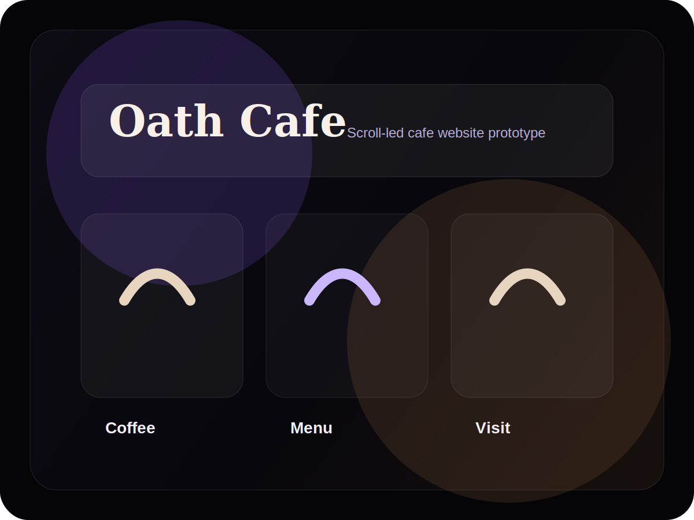

# Oath Cafe Website

A cafe website case study focused on scroll-led storytelling, product appetite, media preparation, location confidence, and conversion-friendly UX.

This public repo is a recruiter-facing case study. The private prototype/source is not published here.

## Recruiter Signal

- Shows research-to-prototype thinking for a public-facing hospitality brand.
- Uses motion and media to support hierarchy rather than decoration.
- Demonstrates practical frontend judgment around responsive, visual-heavy pages.
- Keeps browser profiles, captures, logs, and private prototype materials out of GitHub.

## Project Snapshot

| Area | Detail |
|---|---|
| Role | Research, media audit, interaction prototype |
| Domain | Cafe / F&B website |
| Stack | React, Vite, Framer Motion direction, media optimization |
| Status | Private prototype; public case study |

## What I Focused On

- Scroll-expanding hero direction.
- Product and drink storytelling.
- Menu/category structure.
- Visit and enquiry confidence.
- Public-safe media and repo boundary.

## Public Boundary

This is presented as a concept/prototype case study. Live WhatsApp/map routing, browser profiles, QA captures, logs, and implementation source are not published.

## Read More

- [Case Study](docs/case-study.md)
- [UX Notes](docs/architecture.md)
- [Validation Summary](docs/validation.md)
